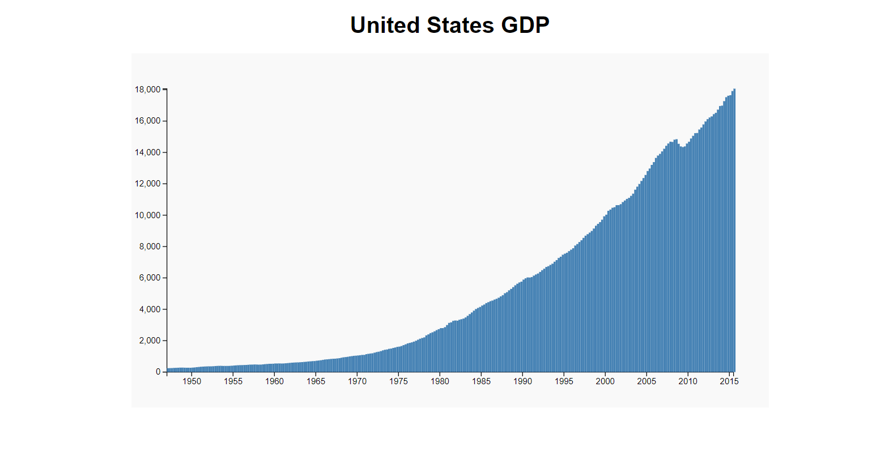

# Visualize-data-with-a-bar-chart

## Project Description

This project visualizes US GDP (Gross Domestic Product) data as a bar chart using D3.js. The data is fetched from a JSON file provided by freeCodeCamp and displayed interactively on a webpage. Users can hover over the bars to see detailed information about GDP values and corresponding dates.

## Project Setup

To set up the project locally, follow these steps:

1. Clone the repository to your local machine using:
   ```bash
   git clone https://github.com/your-username/visualize-data-with-a-bar-chart

[the live site](https://moezltifi.github.io/visualize-data-with-a-bar-chart/)




